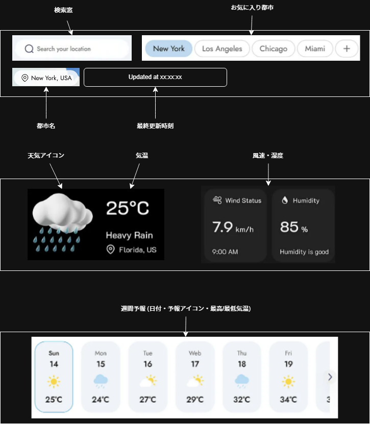
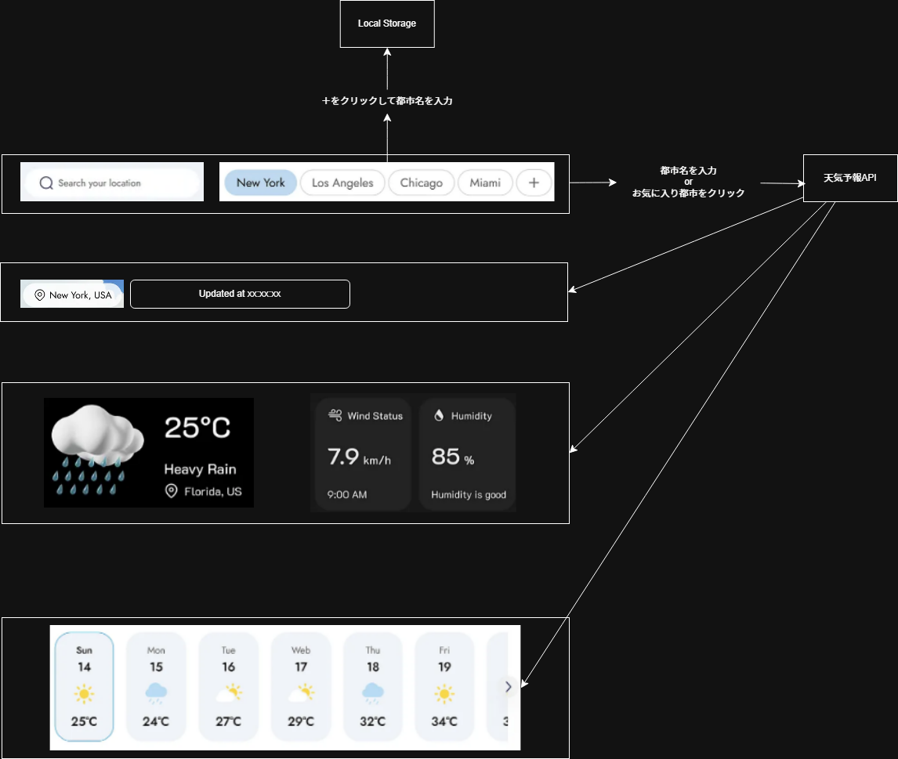

# 出張先天気予報システム

## 1. 要望 (Needs / Desires)

発注元である営業部門の課題と、それを解決するためにシステムに期待されることを明確にします。これは、システムの開発背景となる部分です。

| 項目             | 内容                                                                                                   |
| ---------------- | ------------------------------------------------------------------------------------------------------ |
| **ビジネス目的** | 出張先での天候に起因する準備不足（傘忘れ、服装ミスなど）を解消し、営業活動の効率と快適性を向上させる。 |
| **システム期待** | 複数の出張先や日程の情報を PC 上で俯瞰的に確認できる、情報量の多いダッシュボードであること。           |
| **想定利用者**   | 全国を飛び回る営業担当者。主に社内 PC やノート PC での利用を想定。                                     |

## 2. 要求 (Requests / User Requirements)

要望を満たすために、システムがユーザーに対して提供すべき大まかな機能をリスト形式で整理します。

### 📊 機能カテゴリー

| #       | 機能カテゴリー       | 詳細                                                                                   |
| ------- | -------------------- | -------------------------------------------------------------------------------------- |
| **R-1** | 都市検索・表示       | 日本語で都市名を入力し、その都市の最新の天気情報を即座に表示できること。               |
| **R-2** | 週間予報表示         | 当日だけでなく、出張期間中の 5 日〜7 日程度の予報を一覧またはグラフで確認できること。  |
| **R-4** | お気に入り登録・切替 | よく利用する出張先を登録し、検索の手間なくワンクリックで表示都市を切り替えられること。 |

## 3. 要件

### 1. 画面設計（UI 設計）

#### 1-1. 画面一覧と機能（各画面で何ができるのか？）

| 画面名                                   | 目的                                                           | 主要な機能                                                                                |
| ---------------------------------------- | -------------------------------------------------------------- | ----------------------------------------------------------------------------------------- |
| **ホーム画面 (/)**                       | メインダッシュボードとして、選択中の都市の全情報を俯瞰する。   | 1. 都市検索の実行（検索窓） 2. お気に入り都市への切替 3. 現在の天気と週間予報の確認 |
| **検索結果画面** （ホーム画面と統合） | 検索結果を即座にメインパネルに反映し、エラーがあれば表示する。 | 該当なし エラー時のフィードバック                                                      |

#### 1-2. 表示する情報とレイアウト

画面は、情報の重要度に応じて 3 つの主要エリアに分割される固定グリッドレイアウト（PC 向け）とします。

| エリア                                   | 情報の内容（文字、画像など）                                  | 該当する要件 |
| ---------------------------------------- | ------------------------------------------------------------- | ------------ |
| **A. サマリー/コントロール** （左上） | 📍 都市名、最終更新時刻、検索窓、お気に入り切替ボタン         | R-1, R-4     |
| **B. 現在の天気パネル**                  | ☀️ 気温（文字特大）、天気アイコン（大）、体感温度、湿度、風速 | R-3, R-5     |
| **C. 詳細/予報** （メインエリア）     | 1. 週間予報（日付、予報アイコン、最高/最低気温の表示          |

#### 1-3. 画面遷移図

- 

### 2. 機能設計の具体例 🛠️

裏側のデータ処理やロジックについて、特に API 連携が絡む主要な機能に絞って具体化します。

#### 2-1. 裏側の処理（機能名と処理内容）

| 機能名 (API 名)         | 処理内容 (何をするか)                                                                                         | 担当コンポーネント                     |
| ----------------------- | ------------------------------------------------------------------------------------------------------------- | -------------------------------------- |
| **F-1. 天気データ取得** | 1. 都市名（または ID/緯度経度）を受け取る 2. OpenWeatherMap API へリクエスト 3. JSON レスポンスを受信   | `lib/weather.ts` (Server Component) |
| **F-2. お気に入り保存** | 1. 都市名と ID を受け取る 2. 既存の LocalStorage データに追加 3. 5 件を超えていたら最も古いものを削除   | `lib/storage.ts` (Client Component) |
| **F-3. 検索結果反映**   | 1. ユーザー入力の都市名を受け取る 2. F-1 を実行 3. 取得したデータを画面表示用データに整形し、画面へ渡す | `app/page.tsx` (Server Component)   |

#### 2-2. 処理に必要なデータとデータの受渡し先

| 機能名                  | 処理に必要なデータ            | データの取得元                                           | 処理結果の受渡し先                              |
| ----------------------- | ----------------------------- | -------------------------------------------------------- | ----------------------------------------------- |
| **F-1. 天気データ取得** | API キー、都市名              | 環境変数 (`.env.local`)、`app/page.tsx` (検索窓の入力値) | F-3、F-4 (JSON 形式)                            |
| **F-2. お気に入り保存** | 都市名、都市 ID               | F-1 の取得結果 (`weatherData.name` など)                 | ブラウザの `localStorage`                       |
| **F-3. 検索結果反映**   | F-1 の JSON、F-3 のアドバイス | F-1、F-3                                                 | 画面 (`CurrentWeather.tsx` などの Props へ渡す) |

## 4. 機能設計

### 1. データフロー

- 
